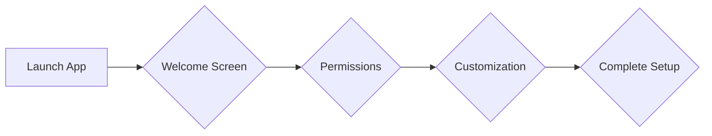

# Design Phase 

### **Research & Inspiration**

### **User Flows**:

**Setting Up the App**

1. **Launch App**
  
     - User opens the app for the first time.

2. **Welcome Screen**

    - User sees a welcome message and an  overview of the app's features.
    - Option to proceed to setup.
  
3. **Permissions**
    - User grants necessary permissions (e.g., access to apps, notifications).

4. **Customization**
   - User customizes the home screen layout, theme, and icon packs.

5. **Complete Setup**
    - User completes the setup process and is directed to the home screen.

