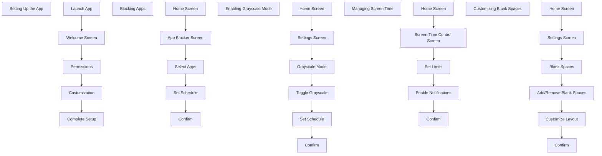

# Design Phase 

### **Research & Inspiration**

### **User Flows**:

**Setting Up the App**

1. **Launch App**
  
     - User opens the app for the first time.

2. **Welcome Screen**

    - User sees a welcome message and an  overview of the app's features.
    - Option to proceed to setup.
  
3. **Permissions**
    - User grants necessary permissions (e.g., access to apps, notifications).

4. **Customization**
   - User customizes the home screen layout, theme, and icon packs.

5. **Complete Setup**
    - User completes the setup process and is directed to the home screen.


```markdown
Setting Up the App
1. Launch App<br>2. Welcome Screen<br>3. Permissions<br>4. Customization<br>5. Complete Setup
Blocking Apps
1. Home Screen<br>2. App Blocker Screen<br>3. Select Apps<br>4. Set Schedule<br>5. Confirm
Enabling Grayscale Mode
1. Home Screen<br>2. Settings Screen<br>3. Grayscale Mode<br>4. Toggle Grayscale<br>5. Set Schedule<br>6. Confirm
Managing Screen Time
1. Home Screen<br>2. Screen Time Control Screen<br>3. Set Limits<br>4. Enable Notifications<br>5. Confirm
Customizing Blank Spaces
1. Home Screen<br>2. Settings Screen<br>3. Blank Spaces<br>4. Add/Remove Blank Spaces<br>5. Customize Layout<br>6. Confirm
```


